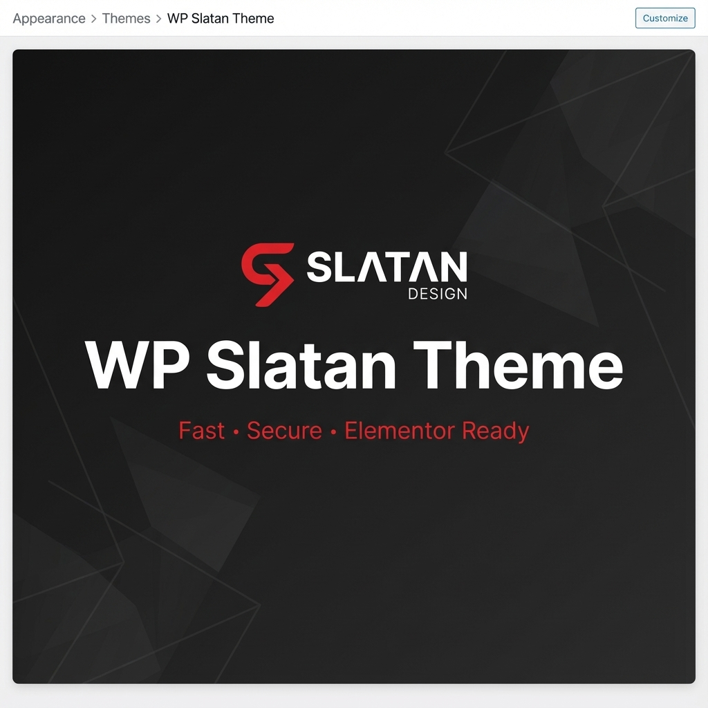

# WP Slatan Theme

**WP Slatan Theme** is a lightweight, high-performance WordPress theme built on top of `_s` (Underscores), specifically optimized for **Elementor**. It comes pre-packed with essential tools like a Floating Contact widget, Code Snippets manager, and built-in security & performance enhancements, reducing the need for multiple external plugins.

## 🚀 Key Features

### 1. Elementor Optimized
- **100% Compatible**: Built to work seamlessly with Elementor Free & Pro.
- **Canvas & Full-Width Templates**: Includes clean templates for landing pages.
- **No Float Bloat**: Minimal CSS footprint to ensure Elementor pages load fast.

### 2. Floating Contact Widget 💬
A built-in, highly customizable floating contact button. No extra plugins required.
- **Multi-Channel Support**: Add links for Line, Facebook Messenger, Phone, WhatsApp, Custom Links, etc.
- **Customizable Design**: Change colors, icons (Font Awesome 5), sizes, and positions.
- **Animations**: Entrance, hover, and menu animations (Slide, Fade, Zoom, Flip, Bounce).
- **Responsive Control**: Show/hide on Desktop or Mobile.
- **Page Targeting**: Display on all pages or specific pages only.

### 3. Code Snippets Manager 👨‍💻
Run custom code without editing `functions.php`. Uses a safe execution environment.
- **Types**: PHP, HTML, CSS, JavaScript.
- **Locations**: Run in Admin, Frontend, or Everywhere.
- **Safe Mode**: Syntax checking before saving to prevent white-screen errors.

### 4. Built-in Security & Performance 🛡️
- **Security Headers**: HSTS, X-Frame-Options, X-XSS-Protection out of the box.
- **SVG Support**: Safe SVG upload support with sanitization.
- **Disables Bloat**: Automatically disables XML-RPC, WordPress Generator meta tag, and other unnecessary headers.

### 5. Auto Updater 🔄
- **License System**: Built-in license manager for automatic theme updates directly from the Slatan Design server.

## 📋 Requirements
- **WordPress**: 6.0 or higher
- **PHP**: 7.4 or higher
- **Elementor**: Recommended (but works without it)

## 📥 Installation

1. Download the theme `.zip` file.
2. Go to **Appearance > Themes > Add New**.
3. Click **Upload Theme** and select the zip file.
4. Click **Install Now** and then **Activate**.

## ⚙️ Configuration

### Floating Contact
Go to **Appearance > Floating Contact** to configure:
1. **Enable**: Toggle the widget on.
2. **Contacts**: Add your contact channels (Line, FB, Call, etc.).
3. **Style**: Customize colors, sizes, and animations.
4. **Display**: Choose where and when to show the widget.

### Code Snippets
Go to **Snippets** in the admin menu:
1. Click **Add New**.
2. Name your snippet and paste your code.
3. Select where to run it (Frontend/Admin).
4. Toggle **Active** and Save.

### Theme Settings & License
Go to **Appearance > Theme Settings**:
1. Enter your **License Key** to receive automatic updates.
2. Configure global performance or security options (if available).

## 🛠️ Credits
- Based on [_s (Underscores)](https://underscores.me/)
- Icons by [Font Awesome](https://fontawesome.com/)

---
**Author**: [Slatan Design](https://slatan.design/)  
**Version**: 1.0.22
